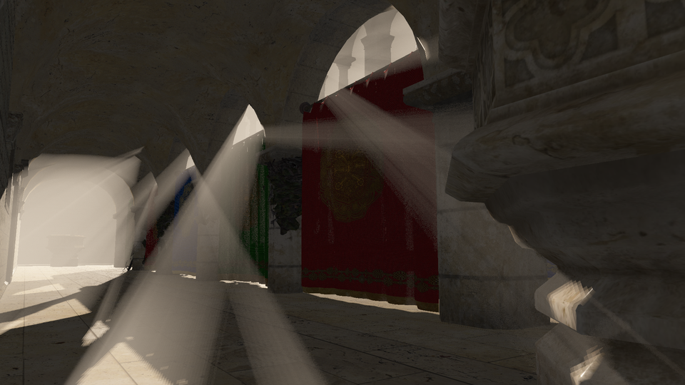

## Introduction

This code renders Sponza in real time. Details:

1. i7, 16GB of RAM, GTX 760. Ubuntu, GLFW3, OpenGL/GLSL, GLTF 2.0, Go (Golang), MIT license.

2. Forward rendering, directional lights, shadow mapping (PCF 3x3), basic PBR (no baking, no ambient term), 3D ray marched volumetric lighting.

[Why yet another rendering code?](https://github.com/paranim/paranim) Why Go? Why OpenGL? Why not Vulkan, Unreal, C++? 

"Different is better than better." A graphics API alone brings so much complexity, why waste time deciphering

```cpp
std::__cxx11::basic_string<char, std::char_traits<char>, std::allocator<char> > const&
```

which should have been just *String*?!

## Why Volumetric Lighting?

It is one of the post 2013 graphics effects that vastly advances immersion and realism. It is also a very smart approximation to [the rendering equation](https://en.wikipedia.org/wiki/Rendering_equation) which connects programming with geometric optics without brute force ray tracing. 

What else is an exponential improvement after say 2013? Rendering [water in INSIDE 2016](https://www.youtube.com/watch?v=RdN06E6Xn9E&t=2755s), [skyscapes in Red Dead Redemption 2 2018](https://www.youtube.com/watch?v=9-HTvoBi0Iw&t=7100s).

## Setup

1. Install [Go](https://go.dev/doc/install).

2. Install Ubuntu dependencies:
    ```console
    sudo apt install xorg-dev libgl1-mesa-dev
    ```

    [Fyne](https://github.com/fyne-io/fyne/blob/master/.github/workflows/platform_tests.yml) and [g3n](https://github.com/g3n/engine) list more of these OpenGL/AL Ubuntu dependencies often linked in Go codes, but the two above should be sufficient here.

3. Download Sponza from github to "Sponza_GLTF": 
    ```console
    sudo apt install subversion
    svn export https://github.com/KhronosGroup/glTF-Sample-Models.git/trunk/2.0/Sponza/glTF Sponza_GLTF
    ```

4. Install Blender:
    ```console
    sudo snap install blender --classic
    sudo snap refresh blender
    ``` 

5. Run Blender, delete the cube by pressing "x", import GLTF 2.0, select "Sponza_GLTF". If you press "n" or open the transform panel, "Dimensions" will show these values:
    ```console
    X = 29.8 m.
    Y = 18.3 m.
    Z = 12.4 m.
    ```
    
    Above "Dimensions" you will see "Scale" values, all of which will be 0.008, which is not right. Select the Sponza building in the Object mode, press ctrl+A and apply the scale. The transform panel's "Scale" values should now become 1.0. The transform panel is toggled by pressing "n".

    Export now the scene in GLTF 2.0 to the "Sponza_GLTF2" folder as "Sponza.gltf". Select "Format" as "GLTF Separate (.gltf + .bin + textures). Uncheck "+Y Up" in the "Transform" tab on the right side of the exporting prompt window, otherwise Y and Z axes will be switched and the camera will be messed up. Just in case, the initial camera position and orientation is set inside the function "makeCam()" in the file "camera.go": 
    ```go
    cam.UpdateOrientation(mgl32.Vec3{10.0, -4.5, 4.0}, mgl32.Vec3{-1.0, 0.9, 0.0}, Z_AXIS)
    ```
  
6. Clone this repo:
  ```console
  git clone https://github.com/aabbtree77/twinpeekz.git
  cd twinpeekz
  ```
  
7. Open "scene.go" and change the Sponza path to the one you reexported in Blender. In my case it is 
  ```console
  folderPath := "/home/tokyo/Sponza_GLTF2/"
  ```

8. Compile and run:
  ```console
  go build
  ./twinpeekz
  ```

## Code Organization and Render Pipeline

There are four layers of code:

1. **main.go**, **camera.go** - GLFW window, mouse, keyboard management. Initial camera position in makeCam() (camera.go). AWSDEC  and arrow keys to move in 3D, holding+LMB changes camera view direction. Scrolling zooms in and out, F11 toggles full screen. Window resizes change certain frame buffers, but the shadow map resolution remains the same.

2. **scene.go** - GLTF loading and some GPU buffer preparation. Each model must have .gltf, .bin and its texture image files in the same folder, tested mostly on an enhanced Sponza scene. There is no missing data filling and excessive checking, if the model does not have all the data it needs to have then it is simply not loaded or some error might occur. You know what is in your GLTF file and adjust scene.go to use the data you need. 	The light directions can be changed starting with line 152: "light0 := Light{...}".

3. **rendering.go**, **shader.go** - the rendering pipeline follows the C++ code of Tomas Öhberg. "shader.go" is the work by Nicholas Blaskey (MIT license), I leave the geometry shader compilation there in case the point lights would need to be added later (they are very expensive, around 2-3ms per light on GTX 760). 

    Notably, the directional lights do not have positions in the shader calculations (only directions), but they do have positions since the light view needs to be rendered into the depth buffer in such a way that an entire scene is covered within each light's mgl32.Ortho(...) box. The meshes outside the light space clipping box will not cast shadows, light will leak through the walls. At the moment, the box sizes are hard-coded and constant per light. The light's position is chosen by simply emanating the ray in the light's direction from the scene's center which is roughly the origin in Sponza. The ray is multiplied by a large scalar value so that the light's "camera" is outside the scene, ready to cover/render it into the depth buffer in the shadow mapping stage. 

4. Shaders:

    **hdr_frag.glsl** - this is the PBR code which I took from Angel Ortiz (MIT licensed), I removed light baking and the abient light contribution term.

    **vol_frag.glsl** - implements two approaches, the one by Andre Pestana (ray marches over visibility * phase func) and by Jake Ryan (marches just over visibility and postprocesses it into a color), see the links in those files. 

    **postpr_frag.glsl** - simply adds the hdr and volumetric colors and postprocesses them in some standard ways. There is an option to clamp a bit the 
    volumetric part to emphasize "god rays", but this also saturates colors, and one can also strengthen rays by adjusting Beer-related parameters in vol_frag.glsl,
    or treating color as radiance in Pestana's method (simply multiplying light.color by some intensity value).

The pipeline splits into

shadow mapping -> hdr (PBR) -> volumetrics -> postprocessing.

The execution time will depend on the number of lights and the shadow map texture sizes. Given a single directional light source and 4096x4096 textures, pure OpenGL rendering stage (measurement taken randomly, the last value summarizes all the stages):

timeOpenGLms = [1.190624 3.639968 2.843136 0.210208 7.883936]

squeezes a volumetrically rendered Sponza frame under 8ms.

Timing with two directional lights:

timeOpenGLms= [1.918592 3.783936 4.978624 0.210656 10.891808].

This is the raw OpenGL part. The overall frame rendering time depends a lot on whether one turns on/off VSync, line 152 in main.go:

```go
glfw.SwapInterval(0)
```

When this is set to zero (VSync=Off), the overall frame rendering time is timeOpenGLms plus about 0.4ms. on average, never exceeding 1ms.
VSync=On keeps the scene at the 60 FPS rate with 16-17ms rendering time. 

The Go runtime is very fast here, but one should emphasize that all Go does is OpenGL buffer rebinding and GLSL shader setup in the main render loop. All the meshes and textures are uploaded to the GPU in the initialization phase. The code does not perform any adaptive frustum computations or mesh removal/GPU uploads.

## Rendering Discussion I: Shadows

I have initially ported the PCSS code taken from the MIT-licensed C++ (GLSL) code by Dihara Wijetunga:

https://github.com/diharaw/PercentageCloserSoftShadows

However, I was severely disappointed by its characteristics and timing, see the images below.

<table>
<tr>
<th> PCF 3x3, time = 1.1+2.2 ms </th>
<th> PCSS(128, 128), time = 1.1+75 ms</th>
</tr>
<tr>
<td>

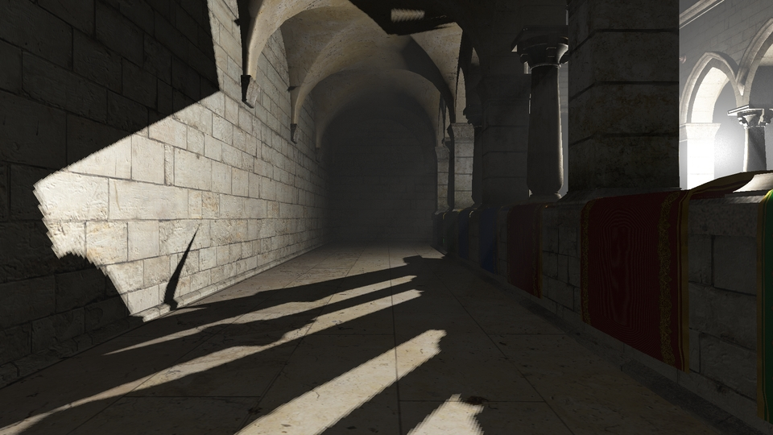

</td>
<td>

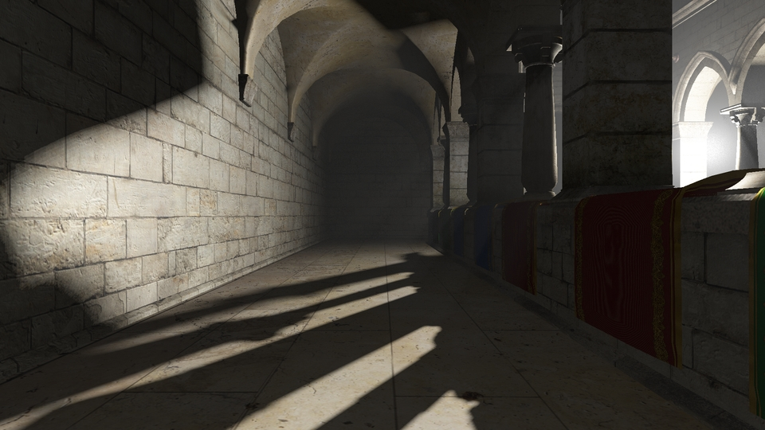

</td>
</tr>
</table>

<table>
<tr>
<th> PCSS(16, 16), time = 1.1+6.5 ms</th>
<th> PCSS(4, 25), time = 1.1+5.8 ms</th>
</tr>
<tr>
<td>

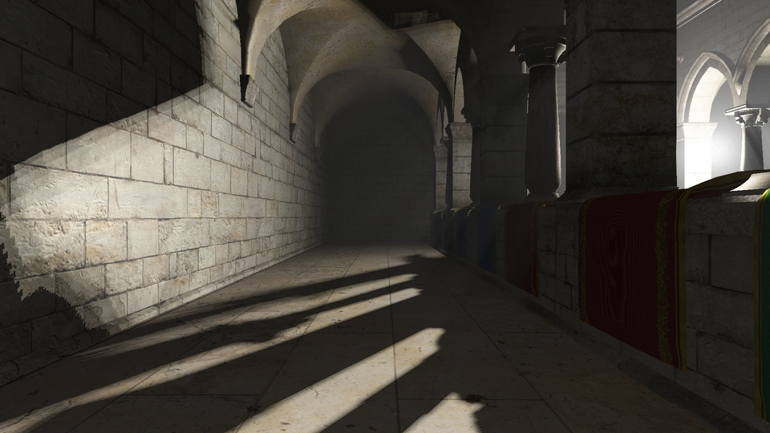

</td>
<td>

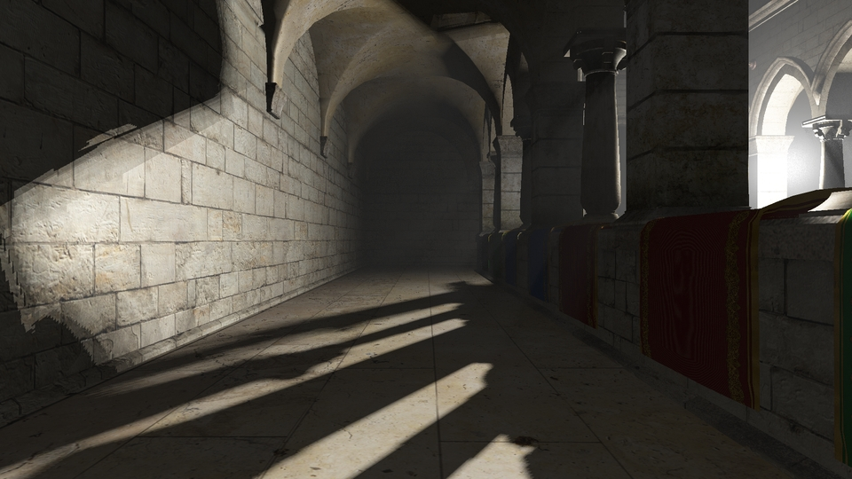

</td>
</tr>
</table>

Shadow map resolution is 4096 in all the cases. The bare PCF 3x3 can be even better as PCSS makes certain shadows vanish.
Look into the shadow stripe on the left side, on the wall. It comes from the real bar-like mesh attached to the wall in the central part of Sponza which is not visible in the image. Notice how even ideal PCSS, which takes ages to compute (whole 75ms.), totally blurs away that shadow stripe.

Smaller internal blocker search and PCSS PCF values (which already take 3-4 extra ms.) produce artifacts which barely improve a raw shadow mapping with PCF 3x3.
So PCSS is a no go for me. It is probably a tool for some baking/prerendering that might give a smooth visual feel to the scene, or rendering at smaller shadow map resolutions followed by some filters, but it is better to simply increase the shadow map resolution as this stage takes roughly only 1ms. for 4K on my GTX 760, albeit for a single light.

VSM, ESM as faster smooth shadow alternatives? I deeply suspect many already went that way and did not find peace. So instead of trying every soft shadow technique one should probably just bite the bullet and go with an industry standard CSM. However, CSM introduces a significant jump in complexity. The code leaks from shaders to higher levels with all sorts of frustum computations and cascade stabilization and AA to avoid various "frame shimmering" effects. Considering all this baggage, the basic shadow mapping with PCF 3x3 at higher resolution such as 4K seems to be OK, until better, ray tracing times...

## Rendering Discussion II: PBR

Let us see some little PBR in action. 

<table>
<tr>
<th style="text-align:center"> Pseudo-PBR Rendering by Tomas Öhberg with a Dim Point Light Setup </th>
<th style="text-align:center"> PBR Rendering with Full Volumetrics </th>
</tr>
<tr>
<td>

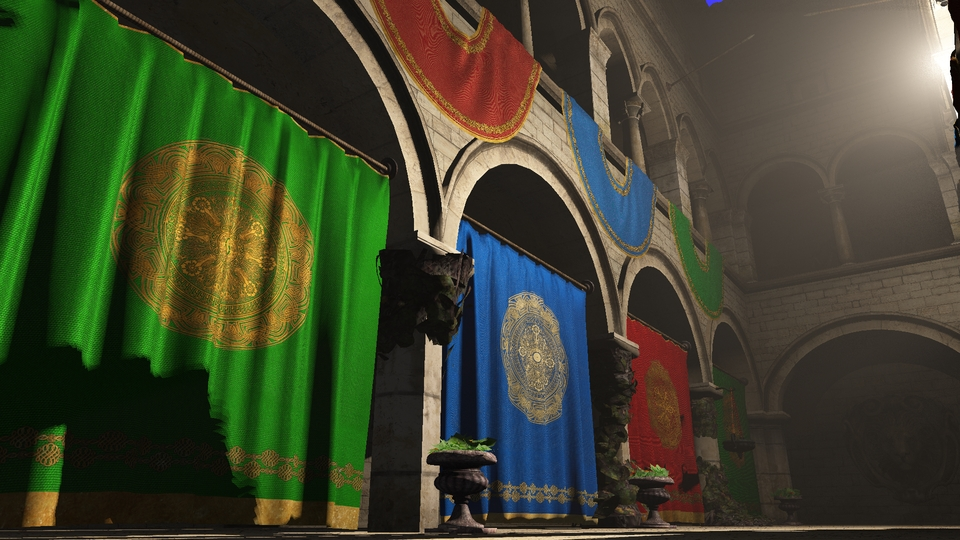

</td>
<td>

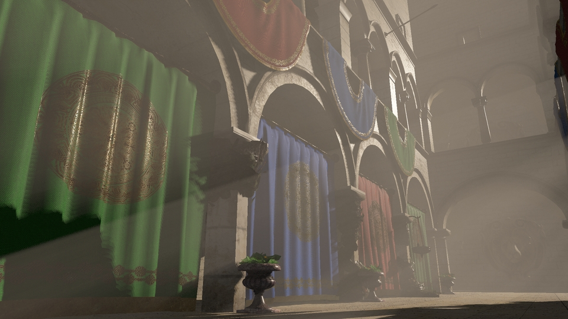

</td>
</tr>
</table>

Despite an overexposure of colors due to the light rays, you can see the specular/metallic reflections from the vases and the curtains, while these are less visible in the pseudo-PBR rendering (Tomas Öhberg code) even in the low volumetric exposure. These highlights also move as the camera view changes, enhancing 3D experience in the both cases. The pseudo-PBR also emphasizes the edges of the curtain better.

What is the pseudo PBR? It is a shortcut I use for Tomas Öhberg's code. It has its own simplistic physics that includes specular highlights, but it does not use
the metallic roughness textures, only the base color which is also called "diffuse color".

Let us evaluate some more images.

<table>
<tr>
<th style="text-align:center"> PBR, Darker Setup, Non-Volumetric</th>
</tr>
<tr>
<td>
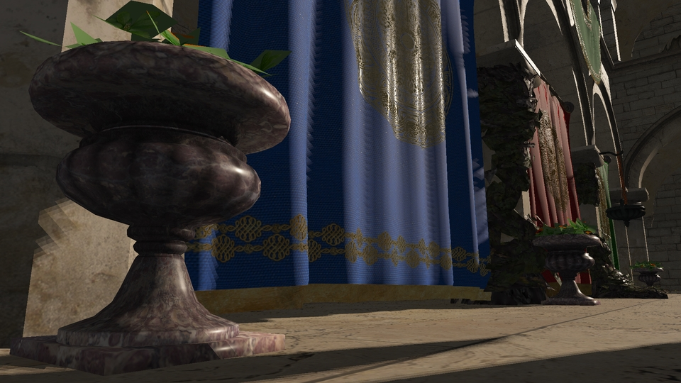
</td>
</tr>
</table>

<table>
<tr>
<th style="text-align:center"> Pseudo-PBR, Darker Setup, Non-Volumetric</th>
</tr>
<tr>
<td>
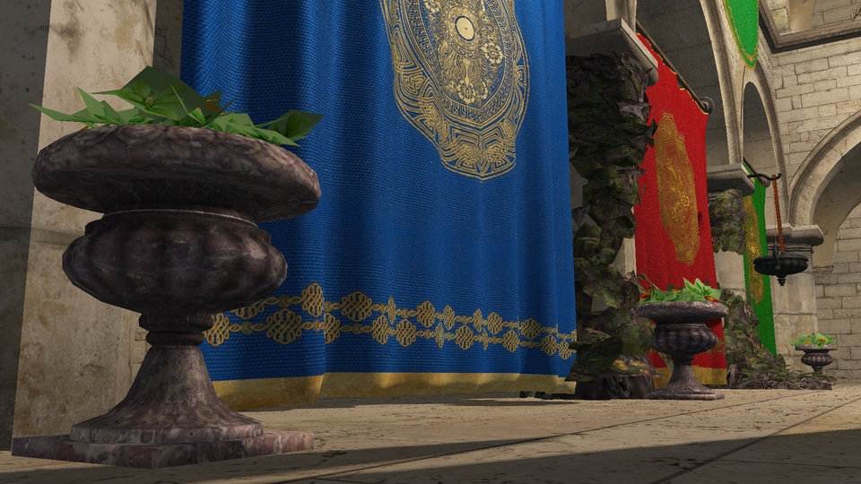
</td>
</tr>
</table>

<table>
<tr>
<th style="text-align:center"> Pseudo-PBR, Bright Setup, Non-Volumetric</th>
</tr>
<tr>
<td>
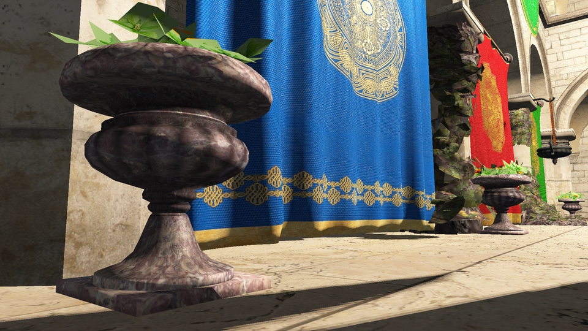
</td>
</tr>
</table>

With a similar light intensity, pseudo-PBR is less playful, and the material is more dry and digital, but with a lot more light it exhibits some highlight generation. That proper light intensity region however is very narrow as with more light the shadow-light diffuse effects begin to dominate specular/metallic reflections which become barely visible, while in low light intensity settings the material has no highlights. Pseudo-PBR highlights are also bigger and more blurry, the surfaces do not have that thin glass layer that plays nicely with light.

On the other hand, somewhat brute shadows and mesh resolutions destroy the realism and mood if you start zooming or getting close to the objects.
So a PBR is a fine tool which must go hand in hand with some other improvements. At the moment, no IBL and no ambient terms, I consider this as an unnecessary code complexity. Ambience is achieved by simply adding the base color weighted with some 0.01 factor and such, this is too crude, but I like things look a bit darker and do not mind underexposure and lack of detail in dark areas.

In addition to baking and ambience, a proper PBR would bring one more complication, which is the tangent-bitangent space usually relegated either to Assimp, or custom C++ implementations. So the mesh essentially gets one more GPU tangent buffer in addition to normals. However, it is still possible to compute tangents directly in the shader, but this might reduce the performance. 

For some future implementation, I will mention three references here:

1. C++ Assimp, e.g. used by Arcane (MIT licensed):

    https://github.com/Ershany/Arcane-Engine/blob/78c9e6931704a36875f325f0449ddb04c9335032/Arcane%20Engine%20Core/src/graphics/mesh/Model.cpp

    const aiScene *scene = import.ReadFile(path, aiProcess_Triangulate | aiProcess_FlipUVs | aiProcess_CalcTangentSpace);

    Interesingly, CSM implementation intent is on Brady Jessup's Trello list since 2018, which just shows there is no simple answer to the shadow problem. See perhaps the CSM implementation by Dihara Wijetunga which was used by the Skylicht engine.

2. This custom C++ implementation

    https://github.com/Snowapril/gl_shaded_gltfscene/blob/5c6c766b4bf6efe7096184339173495606fc4d7c/Sources/Core/GLTFScene.cpp

    references the actual algorithm:

    //! Implementation in "Foundations of Game Engine Development : Volume2 Rendering"

3. Shader-based, my favorite most likely, exemplified by Lugdunum (MIT-licensed):

    https://github.com/Lugdunum3D/Lugdunum/blob/b6d6907d034fdba1ffc278b96598eba1d860f0d4/resources/shaders/forward/shader.frag
    ```console
    # if IN_TANGENT
        const vec3 tangent = normalize(inTangent.xyz);
        const vec3 bitangent = normalize(cross(inNormalWorldSpace, tangent) * inTangent.w);
        # else
        const vec3 deltaPosX = dFdx(inPositionWorldSpace);
        const vec3 deltaPosY = dFdy(inPositionWorldSpace);
        const vec2 deltaUvX = dFdx(TEXTURE_NORMAL_UV);
        const vec2 deltaUvY = dFdy(TEXTURE_NORMAL_UV);

        const vec3 tangent = normalize(deltaPosX * deltaUvY.t - deltaPosY * deltaUvX.t);
        const vec3 bitangent = -normalize(cross(inNormalWorldSpace, tangent));
        # endif

        const mat3 tbn = mat3(tangent, bitangent, inNormalWorldSpace);
    ```
    Here dFdx, dFdy are standard OpenGL functions, "return the partial derivative of an argument with respect to x or y".

    Another potentially useful reference for this method is this MIT-licensed code:

    https://github.com/kosowski/SimplePBR/blob/master/data/shaders/pbr/simplepbr.frag

    It uses Java-based Processing framework where the uniforms are set up, the function is "computeTangentFrame".

## Rendering Discussion III: Volumetric Light

<table>
<tr>
<th style="text-align:center"> Volumetric Lighting: Andre Pestana, Time = [1.06 3.78 2.52 0.21 7.58] ms </th>
<th style="text-align:center"> Volumetric Lighting: Jake Ryan, Time = [1.06 4.07 2.54 0.35 8.03] ms </th>
</tr>
<tr>
<td>

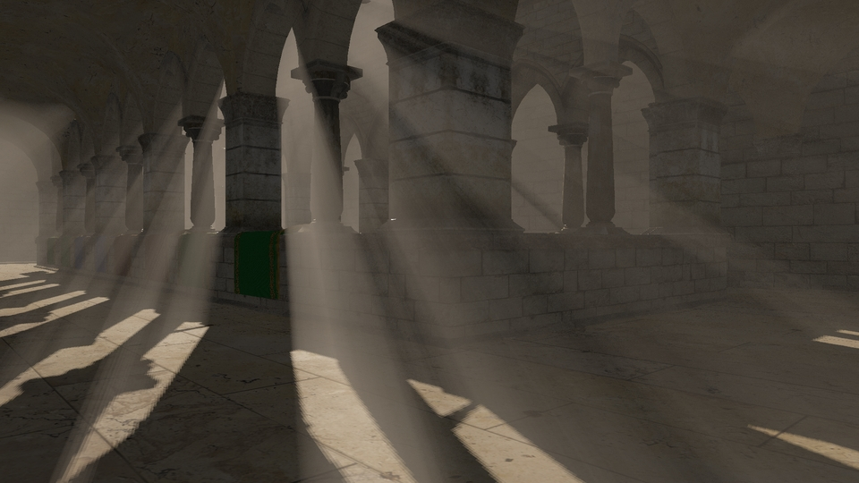

</td>
<td>

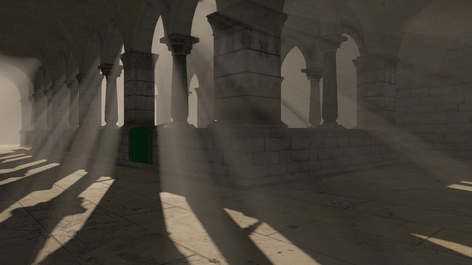

</td>
</tr>
</table>

The timings are provided for each rendering stage separately, supplied with the final total value of the rendered frame duration.

## Golang Experience Report

Here is the log of the GC:

```console
gc 3 @7.479s 0%: 0.051+24+0.004 ms clock, 0.41+0.47/0.22/0.14+0.036 ms cpu, 17->17->0 MB, 18 MB goal, 8 P
gc 4 @15.446s 0%: 0.042+0.73+0.047 ms clock, 0.34+0.18/0.60/0+0.38 ms cpu, 4->4->0 MB, 5 MB goal, 8 P
gc 5 @23.529s 0%: 0.038+0.39+0.009 ms clock, 0.30+0.15/0.47/0.35+0.079 ms cpu, 4->4->0 MB, 5 MB goal, 8 P
gc 6 @31.596s 0%: 0.037+0.60+0.005 ms clock, 0.30+0.15/0.58/0.033+0.046 ms cpu, 4->4->0 MB, 5 MB goal, 8 P
gc 7 @39.612s 0%: 0.038+0.48+0.032 ms clock, 0.30+0.15/0.51/0.54+0.25 ms cpu, 4->4->0 MB, 5 MB goal, 8 P
gc 8 @47.679s 0%: 0.043+0.59+0.10 ms clock, 0.35+0.081/0.64/0.52+0.81 ms cpu, 4->4->0 MB, 5 MB goal, 8 P
gc 9 @55.745s 0%: 0.037+0.34+0.007 ms clock, 0.30+0.32/0.49/0.15+0.058 ms cpu, 4->4->0 MB, 5 MB goal, 8 P
gc 10 @63.729s 0%: 0.040+0.67+0.14 ms clock, 0.32+0.16/0.56/0.33+1.1 ms cpu, 4->4->0 MB, 5 MB goal, 8 P
gc 11 @71.812s 0%: 0.047+0.63+0.008 ms clock, 0.38+0.14/0.62/0.094+0.068 ms cpu, 4->4->0 MB, 5 MB goal, 8 P
gc 12 @79.878s 0%: 0.039+0.76+0.033 ms clock, 0.31+0.18/0.66/0.030+0.26 ms cpu, 4->4->0 MB, 5 MB goal, 8 P
gc 13 @87.962s 0%: 0.040+0.61+0.009 ms clock, 0.32+0.18/0.59/0.42+0.073 ms cpu, 4->4->0 MB, 5 MB goal, 8 P
gc 14 @96.045s 0%: 0.044+25+0.006 ms clock, 0.35+0.33/0.42/0.14+0.051 ms cpu, 4->4->0 MB, 5 MB goal, 8 P
gc 15 @104.045s 0%: 0.040+1.3+0.062 ms clock, 0.32+0.81/0.70/1.5+0.50 ms cpu, 4->4->0 MB, 5 MB goal, 8 P
gc 16 @112.129s 0%: 0.036+0.60+0.005 ms clock, 0.29+0.17/0.61/0.029+0.046 ms cpu, 4->4->0 MB, 5 MB goal, 8 P
gc 17 @120.128s 0%: 0.040+0.44+0.11 ms clock, 0.32+0.18/0.53/0.51+0.94 ms cpu, 4->4->0 MB, 5 MB goal, 8 P
gc 18 @128.178s 0%: 0.036+0.52+0.008 ms clock, 0.28+0.17/0.59/0.58+0.070 ms cpu, 4->4->0 MB, 5 MB goal, 8 P
gc 19 @136.195s 0%: 0.054+0.81+0.007 ms clock, 0.43+0.088/0.36/0.63+0.062 ms cpu, 4->4->0 MB, 5 MB goal, 8 P
gc 20 @144.261s 0%: 0.037+0.58+0.005 ms clock, 0.30+0.14/0.59/0.045+0.045 ms cpu, 4->4->0 MB, 5 MB goal, 8 P
gc 21 @152.345s 0%: 0.038+0.48+0.006 ms clock, 0.30+0.15/0.50/0.52+0.054 ms cpu, 4->4->0 MB, 5 MB goal, 8 P
gc 22 @160.361s 0%: 0.038+0.48+0.020 ms clock, 0.31+0.17/0.56/0.33+0.16 ms cpu, 4->4->0 MB, 5 MB goal, 8 P
gc 23 @168.411s 0%: 0.038+0.67+0.013 ms clock, 0.31+0.16/0.60/0.021+0.10 ms cpu, 4->4->0 MB, 5 MB goal, 8 P
gc 24 @176.511s 0%: 0.036+0.39+0.006 ms clock, 0.29+0.14/0.53/0.19+0.053 ms cpu, 4->4->0 MB, 5 MB goal, 8 P
gc 25 @184.594s 0%: 0.039+0.66+0.006 ms clock, 0.31+0.16/0.68/0.032+0.049 ms cpu, 4->4->0 MB, 5 MB goal, 8 P
gc 26 @192.711s 0%: 0.038+0.55+0.10 ms clock, 0.30+0.34/0.59/0.28+0.80 ms cpu, 4->4->0 MB, 5 MB goal, 8 P
gc 27 @200.728s 0%: 0.037+0.35+0.006 ms clock, 0.30+0.32/0.47/0.19+0.053 ms cpu, 4->4->0 MB, 5 MB goal, 8 P
gc 28 @208.761s 0%: 0.036+0.41+0.006 ms clock, 0.29+0.23/0.47/0.48+0.052 ms cpu, 4->4->0 MB, 5 MB goal, 8 P
gc 29 @216.793s 0%: 0.036+0.40+0.007 ms clock, 0.28+0.13/0.47/0.48+0.061 ms cpu, 4->4->0 MB, 5 MB goal, 8 P
gc 30 @224.843s 0%: 0.045+0.52+0.063 ms clock, 0.36+0.33/0.53/0.41+0.50 ms cpu, 4->4->0 MB, 5 MB goal, 8 P
gc 31 @232.844s 0%: 0.038+24+0.004 ms clock, 0.31+0.27/0.42/0.28+0.035 ms cpu, 4->4->0 MB, 5 MB goal, 8 P
gc 32 @240.827s 0%: 0.029+18+0.006 ms clock, 0.23+0.27/0.34/0.15+0.055 ms cpu, 4->4->0 MB, 5 MB goal, 8 P
gc 33 @248.944s 0%: 0.036+0.49+0.015 ms clock, 0.29+0.13/0.53/0.38+0.12 ms cpu, 4->4->0 MB, 5 MB goal, 8 P
gc 34 @256.977s 0%: 0.036+0.61+0.009 ms clock, 0.29+0.17/0.53/0.51+0.074 ms cpu, 4->4->0 MB, 5 MB goal, 8 P
gc 35 @265.027s 0%: 0.037+0.43+0.011 ms clock, 0.30+0.30/0.48/0.48+0.088 ms cpu, 4->4->0 MB, 5 MB goal, 8 P
gc 36 @273.077s 0%: 0.096+24+0.005 ms clock, 0.77+0.40/0.29/0.088+0.046 ms cpu, 4->4->0 MB, 5 MB goal, 8 P
gc 37 @281.144s 0%: 0.038+0.53+0.12 ms clock, 0.30+0.15/0.63/0+0.99 ms cpu, 4->4->0 MB, 5 MB goal, 8 P
gc 38 @289.227s 0%: 0.061+0.56+0.10 ms clock, 0.49+0.17/0.48/0.47+0.83 ms cpu, 4->4->0 MB, 5 MB goal, 8 P
gc 39 @297.243s 0%: 0.037+18+0.006 ms clock, 0.29+0.33/0.47/0.24+0.050 ms cpu, 4->4->0 MB, 5 MB goal, 8 P
gc 40 @305.260s 0%: 0.050+15+0.005 ms clock, 0.40+0.48/0.33/0.23+0.045 ms cpu, 4->4->0 MB, 5 MB goal, 8 P
gc 41 @313.327s 0%: 0.031+0.63+0.006 ms clock, 0.24+0.12/0.63/0.049+0.049 ms cpu, 4->4->0 MB, 5 MB goal, 8 P
gc 42 @321.326s 0%: 0.049+0.56+0.006 ms clock, 0.39+0.15/0.56/0.022+0.048 ms cpu, 4->4->0 MB, 5 MB goal, 8 P
gc 43 @329.409s 0%: 0.042+0.51+0.072 ms clock, 0.34+0.18/0.57/0.66+0.57 ms cpu, 4->4->0 MB, 5 MB goal, 8 P
gc 44 @337.425s 0%: 0.046+0.42+0.006 ms clock, 0.37+0.14/0.49/0.60+0.054 ms cpu, 4->4->0 MB, 5 MB goal, 8 P
gc 45 @345.492s 0%: 0.037+14+0.007 ms clock, 0.30+0.41/0.31/0.29+0.057 ms cpu, 4->4->0 MB, 5 MB goal, 8 P
gc 46 @353.542s 0%: 0.045+15+0.006 ms clock, 0.36+0.25/0.58/0.27+0.051 ms cpu, 4->4->0 MB, 5 MB goal, 8 P
```

The default GC setup does not consume more than 1ms every 8s or so. However, a spike wasting whole 24ms may occur once a minute. Dropping a frame or two per minute does not break any smooth 3D experience. On the other hand, the codes renders a static scene, so having a GC is dangerous.

One interesting feature about Go was that inside main.go, there was no need to use unsafe pointers to pass user 
data to the GLFW callbacks. By setting a struct method as a callback, the callback had access to the data of the structure.

Pointers bring [bugs](https://github.com/g3n/engine/issues/163). [The billion dollar mistake](https://github.com/tcard/sgo)...

Go types and libs were plain/flat enough to reach anything with printf. I relied on go-vim and its :GoDef with ctrl+O to get back. These two commands helped to navigate 3rd party codes. However, I could start working with Quim Muntal's GLTF library with its virtually nonexisting docs only by reading [Issue #26](https://github.com/qmuntal/gltf/issues/26). Still, a huge plus for Golang in that 3rd party codes can often be grokked without too much suffering.

## OpenGL Experience Report

Programming with [GLSL/OpenGL](https://www.youtube.com/watch?v=dd0p0wieVwQ&t=26s&ab_channel=JonathanBlowClips) is very tiresome as there is not much help from the compiler. However, this is only a part of the problem. The bigger issue is the disappearance of an immediate incremental feedback. The OpenGL setup and its state spreads everywhere and one has to write a lot of code before even seeing the first result on the screen. This is the elephant in the room.

I was hunting down one bug for days which was rendering a black screen without a crash. The problem turned out to be gl.BufferData function storing mesh index array on a GPU. I was using
type uint whose analogue in C++ takes 4 bytes of memory, but in Go it's 8! Switching to uint32 simply solved the problem, but to actually locate 
that I had to use RenderDoc. Luckily, I had a working C++ alternative code by Tomas Öhberg, so I could compare the raw data differences in the both cases by loading a simple 3D cube.

An unused variable warning is actually an error:
```console
2021/07/02 11:59:36 Could not find uniform:  metalRoughMap
```
Instead of the variable location in code we get the day of the month.

Tricky: Reading fragment's world position from the depth buffer of the hdr stage in the volumetric ligthing shader.

Implicit behaviour. [This code](https://github.com/guzba/gltfviewer) does not use "glActiveTexture()" to activate the texture unit, yet the rendering still works even without setting up a certain sampler2D uniform to render the mesh colors. It turns out that a single sampler2D uniform in the fragment shader gets implicitly linked to the default zero texture unit, i.e. see [this SO](https://stackoverflow.com/questions/10868958/what-does-sampler2d-store). Texture units are not texture ids. 

## cloc and [clocrt](https://github.com/michalspano/clocrt)

| Language | files | blank | comment | code |
| :------: | :---: | :---: | :-----: | :--: |
| Go       | 5     | 238   | 227     | 961  |
| Markdown | 1     | 184   | 0       | 379  |
| GLSL     | 7     | 107   | 89      | 261  |
| SUM:     | 13    | 529   | 316     | 1601 |

## To Do (Or Not)

* Focus on mesh instancing and complete scene export from Blender, in GLTF 2.0. Should lights/camera be read from the GLTF/Blender?

* May need an optimized scene graph, look into [Kosarevsky et al. 2024, Chapter 8](https://github.com/PacktPublishing/3D-Graphics-Rendering-Cookbook-Second-Edition).

* Reliable GLTF: failback/failover w.r.t. broken file paths and assets, e.g. Sponza primitive No. 12 (rusty chain) has no 
MetallicRoughnessTexture in Sponza.gltf. Fall back to pseudo-PBR. Warn/adjust unusual mesh scales.

* CSM, AA, baking, culling, LOD popping, bloom/glow, TOML to organize parameters.

* A tighter adaptive frustum for each light and camera.

* Better isolate OpenGL state/context, or drop OpenGL entirely in favor of, say, [Vulkan?](https://github.com/oakes/vulkan_triangle_nim/blob/master/src/core.nim)

    OpenGL has ["Learn OpenGL"](https://learnopengl.com/), but it is old and not easy/reliable at all.

    Vulkan is too low level, good to run, say, [d3d9-d3d11 on Linux](https://github.com/doitsujin/dxvk/issues/3789). 
    
    [WebGPU](https://eliemichel.github.io/LearnWebGPU/introduction.html) is still not there, but it could be the best option.

* Surface-underwater transitions as in [INSIDE 2016](https://youtu.be/RdN06E6Xn9E?t=2755).

* A skybox would be nice, but anything "samplerCube" related takes 3ms. on GTX 760. Dual-paraboloid maps as in [GTA-5](https://www.adriancourreges.com/blog/2015/11/02/gta-v-graphics-study/)?

* [Forward vs Deferred vs Forward+](https://www.3dgep.com/forward-plus/). Forward is alright, but it does not matter. INSIDE 2016 used deferred rendering. Forward+? See Maximilian Mader's code in the references below.

* Animations, hot reloading, ImGui, ECS, physics engine. See [David H. Eberly, 2010](https://www.amazon.com/Game-Physics-David-H-Eberly/dp/0123749034), [qu3e](https://github.com/RandyGaul/qu3e)...

* [Replace Go with Nim?](https://github.com/aabbtree77/twinpeekz2)

    <div align="center">
      
    </div>

    [Write in Go?](https://www.youtube.com/watch?v=LJvEIjRBSDA&ab_channel=ScaleAbility)

    [You'll be back (to Go)?](https://www.youtube.com/watch?v=rzo8u03vC7Y&ab_channel=MatRyer)

## A Note about Go (2025)

Go is readable, compiles fast, has a build system ("packages"), and a package manager ("module system") with over a million repositories on github.com. However, Go is still in the older generation of static languages with no ability to say that something is of type A or B. Check [this AST](https://github.com/fadion/aria/blob/master/ast/ast.go) in Go, and compare it with [the unions in Odin](https://github.com/spencerNelson-dev/monkey/blob/main/ast/ast.odin). The latter is an absolute godsend.

Nonetheless, Go must be used where it shines with its runtime: distributed caches, queues, job scheduling, messaging, and [P2P](https://libp2p.io/implementations/). Mountains of code related to [concurrency and microservices](https://github.com/avelino/awesome-go): [Thomas Kappler](https://github.com/thomas11/csp), [Katherine Cox-Buday](https://edu.anarcho-copy.org/Programming%20Languages/Go/Concurrency%20in%20Go.pdf), [Sameer Ajmani](https://www.youtube.com/watch?v=_YK0viplIl4&ab_channel=dotconferences), [Rob Pike and Kevin Niechen](https://github.com/kevinniechen/go-concurrency-patterns), [Rob Pike](https://www.youtube.com/watch?v=oV9rvDllKEg&ab_channel=gnbitcom), [A.A.A. Donovan and B.W. Kernighan: 9.7. Example: Concurrent Non-Blocking Cache](https://www.gopl.io/), [A.A.A. Donovan: Starlark](https://www.youtube.com/watch?v=9P_YKVhncWI&t=103s&ab_channel=NationConfrences), [Thang Chung](https://github.com/thangchung/go-coffeeshop), [Ken Hibino](https://github.com/hibiken/asynq), [Uber](uber-go/cff)...
       
## Credits, Rendering Frameworks I Have Tried, Many Thanks To:

0. **Joey de Vries**. [Learn OpenGL](https://learnopengl.com/), 2014.

1. **Tomas Öhberg**. Initially I was simply translating his marvelous C++ work written in the Autumn of 2017:

    https://gitlab.com/tomasoh/100_procent_more_volume

    [https://youtu.be/Bafoekti34Y](https://youtu.be/Bafoekti34Y)

    It is a reasonable POD-mostly clean C++ that completely implements the method of Balázs Tóth and Tamás Umenhoffer (EUROGRAPHICS 2009). The translation was not smooth due to the bug I mentioned above and some OpenGL issues with sending an array of light structs to the shaders. The rays were initially bleak and numerous scattering parameters barely changed anything visually. I have clamped the ray intensity artificially at first, and the code for that is still included in the postprocessing shader. Considering the other two volumetric methods this problem is gone now. Parsing .obj files instead of GLTF 2.0, suboptimal PBR... An amazing work nonetheless.

2. **Baldur Karlsson** (and Crytek?) for RenderDoc which helped me to locate wrong mesh buffer indexing in "scene.go" (uint vs uint32!).

3. **Andre Pestana** for volumetrics and metallicRoughness:

    https://www.alexandre-pestana.com/volumetric-lights/

    https://www.alexandre-pestana.com/pbr-textures-sponza/

4. **Jake Ryan** for volumetrics:

    https://github.com/JuanDiegoMontoya/GLest-Rendererer/blob/main/glRenderer/Resources/Shaders/volumetric.fs

    Both of these works do not have licenses, but this should not be a problem. Andre Pestana is also the one who added metallicRoughness textures to Sponza via Subtance Designer.

5. **Dihara Wijetunga** for PCSS which I initially incorporated in my Go-controlled shaders, but eventually dropped as it is a wrong tool for real time rendering. His dwSampleFramework (MIT-licensed) is also quite a candidate to dissect and rewrite in more productive languages. It has OpenGL and Vulkan codes written side by side, and some interesting extensions scattered in his github repos. It compiles on Ubuntu with an error which is not hard to fix by googling (it comes from VS2019 use). The testing models are not included in some places and need Blender to generate "plane.obj" or rescale "lucy.obj".

6. **Panagiotis Christopoulos Charitos**, who helped me to solve the screen tearing issue which must be pretty common and good to know:

    https://github.com/godlikepanos/anki-3d-engine/issues/59

    His BSD-licensed Anki3d engine is some 2M LOC of C++ with Vulkan API (around 100KLOC of original code and the rest is 3rd party), but it compiles cleanly on Ubuntu, believe it or not, as many folders get some neat localized minimal cmake files. Contrast this to Confetti/The-Forge, (Apache 2.0) which also tries to be Linux friendly (kudos for that!), but distributes only LiteCode project files which are a lot more problematic and Windows-idiomatic, I had some issues with some -m32 flag that I do not remember anymore and also see my comment somewhere below

    https://www.youtube.com/watch?v=uFDa4M4ZBPs 

    Initially I was hoping to learn from any of these two engines, as they were both modern Vulkan-based and had volumetric lights I wanted above anything else. However, my excitement evaporated as I could not get through the jungle of C++ and Vulkan.

7. **Finn Bear** and **Quim Muntal** on this github issue

    https://github.com/qmuntal/gltf/issues/26

    helped me to load the basic GLTF. Without their open correspondence I would not even be able to understand how to use the library. I then guessed the indexing pattern in some other places and relied on vim-go's :GoDef which allows to trace the GLTF structures. The problem is still there, that higher level layer to load everything into some structure is missing, but I understand why it is not there. The GLTF as such is some vast container and there can be so many features added or missing that it is perhaps better to leave it for a user to extract anything he or she wants. You know your GLTF, you write the code. The problem, however, is that nobody knows this all in the beginning, and Blender for instance manages to load everything, so a beginner expects any library to work this way. 
    
    A good clean GLTF code to start porting/extending is [this github code by Ryan Oldenburg](https://github.com/guzba/gltfviewer/blob/master/src/gltfviewer/gltf.nim), written in Nim. 

8. **Maximilian Mader**, for posing some modern C++ Windows-to-Ubuntu portability challenges:

    https://github.com/Max1412/Graphics2/issues/24

    This repo has no license, its main demo window is non-resizable, but it implements a full Wronski's SIGGRAPH 2014 Ubisoft approach to volumetrics, which I was hoping to be a great learning resource, but it turned out to be too complex for me, though it might be worth revisiting some day. Some quite advanced stuff is there: Volumetric textures, compute shaders, C++17 with some meta programming, a simple max function is quite polymorphic there and was causing complex template compilation errors, which was fixed by Maximilian Mader. C++ wise, I am only in the read-only, compile-only mode. 

    Then I encountered an OpenGL error and had the usual long blind dark alley walk which ended in a success without RenderDoc, but I do not know if RenderDoc would have helped me in this case. Again, why this was the problem on Ubuntu, but worked on Windows is beyond me, see the issue.

    This approach is heavier than one might think considering clusters and tiles in use, read the issue for some details and my further link to a specific Unity-related volumetrics discussion below. 

    There is a similar WebGL 2.0 implementation of clustered volumetrics:

    https://github.com/rms13/WebGL2-Volumetric-Renderer

    The code has no license too. Clustered ray marched volumetric ligthing is also implemented in Armory3D (Zlib-licensed), Lumix (MIT-licensed), Flax (commercial OSS), and Anki3d (BSD), but these are big engines and extracting/isolating the necessary bits could be difficult.
    There was someone experimenting with 3D ray marched volumetrics also in the Urho3D community, but the code did not manage to get into the main repo, please correct me if I am wrong.

9. **Michal Skalsky** and his Unity forum discussion:

    https://github.com/SlightlyMad/VolumetricLights

    https://forum.unity.com/threads/true-volumetric-lights-now-open-source.390818/page-5

    An interesting reading with a lot of inspiring images and insights into the problems of the Unity community, despite everything being Windows-centered and non-OpenGL. In order not to get lost in a big discussion, I will cite directly the most important and insightful bit of information here:

    Jun 16, 2016

    *gian-reto alig*:

    Didn't had the chance yet to watch the Adam short... any indication if Unitys volumetric fog approach is any good?

    *Michal_*:

    It is supposedly the same technique as the one introduced in Assassin's Creed 4 (and used in many other games since then). The paper is available online or in GPU Pro 6 book. It is a more general approach but both techniques has their advantages and disadvantages.

    Classic" raymarching approach (this, Killzone etc.) - volumetric effect is computed and immediatelly stored in 2d texture that is later applied to the final image.

    - You can render at native resolution and get best possible quality with crisp edges.
    - Keeps quality even for distant lights
    - Works with pretty much any shadow technique
    - Doesn't support transparent objects out of the box
    - Trading quality for performance is problematic. You can render at lower resolutions but you have to deal with all the "mixed resolution" rendering problems (halos, bleeding, etc.)
    - Probably more expensive per light but can give you better quality.

    Voxel based approach (Unity?, Assassin's Creed, Frostbite etc.) - volumetric effect is computed for "every" point in front of the camera. It is stored in 3d texture for future use.

    - You must render at very low resolution to make it practical. No crisp edges or shadow details. For example, AC4 used 160x90x64 resolution. Roughly 1 000 000 voxels. It would require hundreds of millions of voxels to match the highest quality of the classic technique.
    - Probably not very practical for long drawing distances because of the limited number of depth slices. The range for AC4 was only 100 meters.
    - Shouldn't work very well with current Unity shadows. The shadows have high frequency information and the voxel resolution is very low. That should lead to under-sampling artifacts, aliasing, flickering etc. AC4 used blurred exponential shadows to remove high frequency signal. I'm curious what Unity will do here. Maybe just a temporal super-sampling?
    - Works with transparent object. 3d texture stores light information for every point so you can easily apply this to transparent objects.
    - It is very simple to trade quality for performance. You simply change number of voxels. 3d texture filtering will take care of the rest.
    Whatever they do, I doubt it will work for everybody. There is so many different projects out there. I'm curious if they make it integral part of Unity or keep it as a separate asset.

10. **Daniel Salvadori**, g3n and Gokoban projects. Gokoban is an awesome 3D puzzle game that deserves to be better known. It can be seen as a prototype or a vast simplification of Stephen's Sausage Roll which is highly valued by **Jonathan Blow**. It is too bad that the game requires some knowledge of how to set up 
Go and $GOPATH and is thus not available for non-programmers. I helped solving this issue, which I keep as a memo whenever I need to install this game on Ubuntu:

    https://github.com/danaugrs/gokoban/issues/14

    _Edit 2022: This is no longer an issue as the repository now uses Go modules and compiles without extra efforts._

    TBH, I largely ignored the g3n engine code as I found it quite complex, but I was perhaps too unprepared at the time.
